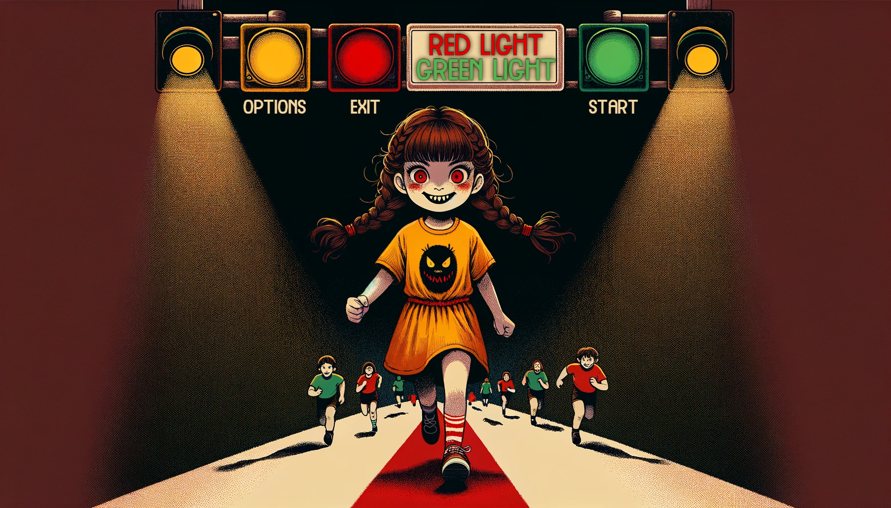

# Red Light, Green Light Game Using Computer Vision
## Introduction
This project explores the application of advanced computer vision techniques in an interactive game inspired by the "Red Light, Green Light" challenge from the popular series "Squid Game." The game leverages real-time motion and posture detection using Python and computer vision libraries such as OpenCV and MediaPipe to track player movements and respond to dynamic conditions.

The game offers both single-player and multiplayer modes:
- **Single-player mode** utilizes MediaPipe's Pose Landmarker for real-time posture detection.
- **Multiplayer mode** employs MobileNet SSD for motion detection.

## Game Mechanics
- **Arena:** The game is designed to be played in an open field with unobstructed view and good lighting conditions. Players start from the beginning line and attempt to reach the finish line.
- **Objective:** Players must move across the field during "green light" intervals and stop during "red light" intervals. Movement detected during a "red light" leads to elimination.
- **Detection Mechanism:** The game uses a webcam to monitor players, detecting motion using computer vision techniques during the "red light" phase. Players detected moving are eliminated.

## Challenges
- **Large-scale Motion Detection:** Efficiently detecting movements among multiple players in a large area.
- **Posture Recognition:** Detecting subtle changes in player posture during the "red light" phase.
- **Environmental Factors:** Accounting for lighting conditions, shadows, and obstructions.
- **Stress-induced Movement:** Differentiating between involuntary movements and intentional ones.

## Installation
### Prerequisites
- **Python 3.7 - 3.9**: [Download Python](https://www.python.org/downloads/)
- **pip**: Comes with Python, but ensure it is installed and updated (`pip --version`).

### Step-by-Step Instructions
**1. Clone the repository:**
```sh
git clone https://github.com/megamiii/RedLightGreenLightCVGame.git
cd RedLightGreenLightCVGame
```

**2. Install the required dependencies:**
```sh
pip install -r requirements.txt
```

Ensure you have Python 3.x and pip installed. The project uses the following main libraries:
- OpenCV (e.g., `opencv-python==4.5.3`)
- MediaPipe (e.g., `mediapipe==0.8.7`)
- Pygame (e.g., `pygame==2.0.1`)
- NumPy (e.g., `numpy==1.21.2`)

**3. Download necessary assets:** Ensure that all assets such as images and sound files are in the `assets` folder.

## Usage
### 1. Run the game:
```sh
python main.py
```

### 2. Game Modes:
- **Single Player Mode:** Track your own movements and posture using the webcam.
- **Multiplayer Mode:** Compete with friends, and the computer vision model will detect any movement during the "red light" phase.

### 3. Control the Game:
- `s` **key:** Start the game.
- `q` **key:** Quit the game.
- `SPACE` **key:** Confirm winning in multiplayer mode.

## Screenshots
### Start Screen

*Main menu where players can choose their game mode.*

### Options Window

*Options menu for configuring game settings and selecting modes.*

## Development
The game is implemented in Python using:
- **OpenCV:** For motion detection and handling the video feed from the webcam.
- **MediaPipe:** For posture detection using the Pose Landmarker module.
- **Pygame:** For UI design, sound effects, and handling game interactions.
  
## Project Structure
```graphql
redlight-greenlight-game/
│
├── assets/                           # Directory for all images, sounds, and other assets
│   └── [asset files...]
├── __pycache__/                      # Cache files for Python modules
├── haarcascade_frontalface_default.xml   # Haar cascade file for face detection
├── opencv_face_detector.prototxt     # Prototxt file for OpenCV face detector
├── opencv_face_detector.pbtxt        # TensorFlow file for OpenCV face detector
├── main.py                           # Entry point for the game
├── single_player.py                  # Single-player mode implementation
├── multiplayer.py                    # Multiplayer mode implementation
└── README.md                         # Project documentation
```

## Future Work
- **Depth Detection:** Incorporating depth sensors to distinguish between real players and reflections.
- **Improved Model Training:** Fine-tuning object detection models to reduce false positives and enhance accuracy.
- **Additional Game Modes:** Expanding the game to include new levels and challenges inspired by "Squid Game."